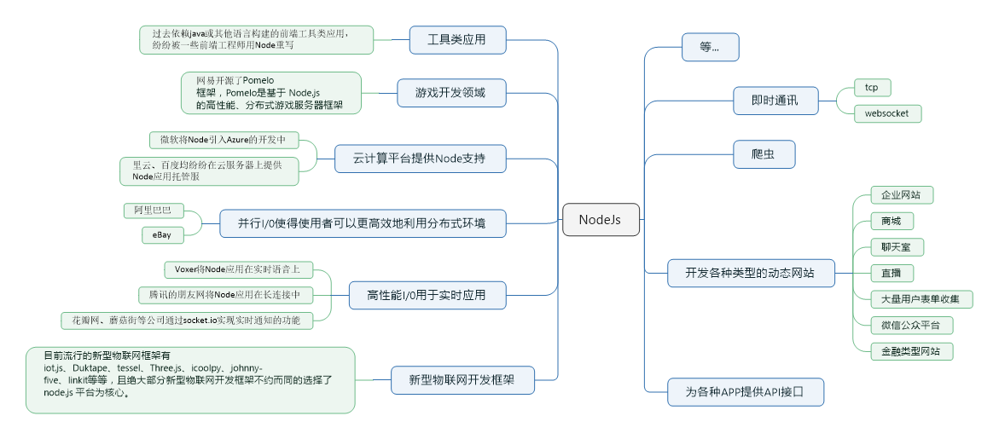

Node.js 是一个 Javascript 运行环境(runtime)。它让 JavaScript 可以开发后端程序， 它几乎能实现其他后端语言能实现的所有功能。

Nodejs 是基于 Google V8 引擎，V8 引擎是 Google 发布的一款开源的 JavaScript 引擎， 原来主要用于 Chrome 浏览器的 JS 解释部分。

##### Nodejs 最擅长高并发:

Nodejs 最擅长的就是处理高并发，在 Java、PHP 或者.net 等服务器端语言中，会为每一个客户端连接创建一个新的线程。而每个线程需要耗费大约 2MB内存。也就是说，理论上，一个 8GB 内存的服务器可以同时连接的最大用户数为 4000 个左右。要让 Web 应用程序支持更多的用户，就需要增加服务器的数量，而 Web 应用程序的硬件成本当然就上升了。Node.js 不为每个客户连接创建一个新的线程，而仅仅使用一个线程。当有用户连接了，就触发一个内部事件，通过非阻塞 I/O、事件驱动机制，让 Node.js 程序宏观上也是并行的。使用 Node.js，一个 8GB 内存的服务器，可以同时处理超过 4 万用户的连接。

##### Nodejs 可实现的功能多:

Nodejs 不仅可以像其他后端语言一样写动态网站、写接口，还可以应用在云计算平台、游戏开发、区块链开发、即时通讯、跨平台 App 开发、桌面应用开发(electron)、云直播、物联网领域等




supervisor 或者 nodemon 启动node服务（自动检查文件改变重启）

```
npm install supervisor -g
npm install nodemon -g


// 启动
supervisor app.js
// 或者
nodemon app.js
```


使用http.createServer()方法创建服务器:

```
const http =require('http');
const url =require('url');

/*
    req   获取客户端传过来的信息
    res  给浏览器响应信息
*/

http.createServer((req,res)=>{
    // http://127.0.0.1:3000/?name=zhangsan&age=20  想获取url传过来的name 和age

    //设置响应头
    //状态码是 200，文件类型是 html，字符集是 utf-8
    res.writeHead(200,{"Content-type":"text/html;charset=utf-8"}); //解决乱码 utf-8不能加引号

    // res.write("<head> <meta charset='UTF-8'></head>");  //也可以通过给html设置字符集解决乱码    

    console.log(req.url);   //获取浏览器访问的地址

    if(req.url!='/favicon.ico'){

        var userinfo=url.parse(req.url,true).query;
        
        console.log(`姓名：${userinfo.name}--年龄:${userinfo.age}`);
    }

    res.end('你好nodejs');  //结束响应

}).listen(3000);
```

```
url.parse() // 解析URL成对象 第一个参数为url值，第二个参数布尔值用来规定返回对象的query值是字符串还是对象
url.format(urlObject) // 是上面url.parse()操作的逆向操作
url.resolve(from,to)  // 添加或者替换地址
```

#### Node中，模块分为两类：

一类是Node提供的模块,称为核心模块；另一类是用户编写的模块，称为文件模块。

- 核心模块部分在Node源代码的编译过程中，编译进了二进制执行文件。在Node进程启动时，部分核心模块就被直接加载进内存中，所以这部分核心模块引入时，文件定位和编译执行这两个步骤可以省略掉，并且在路径分析中优先判断，所以它的加载速度是最快的。如：HTTP模块、URL模块、Fs模块都是nodejs内置的核心模块，可以直接引入使用。
- 文件模块则是在运行时动态加载，需要完整的路径分析、文件定位、编译执行过程、速度相比核心模块稍微慢一些，但是用的非常多。这些模块需要我们自己定义。

#### 完全符合CommonJs规范的包目录一般包含如下这些文件。

- package.json:包描述文件。
- bin:用于存放可执行二进制文件的目录。
- lib:用于存放JavaScript代码的目录。
- doc:用于存放文档的目录


```
npm install ModuleName // 安装模块
npm uninstall moudleName // 卸载模块
npm list // 查看当前目录下已安装的node包
npm info 模块  // 查看模块的版本
npm install jquery@1.8.0 // 指定版本安装
```

#### dependencies与devDependencies之间的区别?

使用npm install node_module --save自动更新dependencies字段值;

使用npm install node_module --save-dev自动更新devDependencies字段值;

```
"dependencies":{
	"ejs":"^2.3.4",
	"express":"^4.13.3",
	"formidable":"^1.0.17"
}
// ^表示第一位版本号不变，后面两位取最新的
// ~表示前两位不变，最后一个取最新
// *表示全部取最新
```

### 安装淘宝镜像

```
npminstall-gcnpm--registry=https://registry.npm.taobao.org
// 使用 cnpm 代替 npm
```


## fs模块

1. fs.stat   检测是文件还是目录

2. fs.mkdir  创建目录

3. fs.writeFile  创建写入文件

4. fs.appendFile 追加文件内容

5. fs.readFile 读取文件

6. fs.readdir读取目录

7. fs.rename 重命名或移动文件

8. fs.rmdir  删除目录

9. fs.unlink 删除文件
10. fs.createReadStream从文件流中读取数据
11. fs.createWriteStream写入文件

```
const fs=require('fs');

// 1. fs.stat   检测是文件还是目录
   
fs.stat('./html',(err,data)=>{
    if(err){
        console.log(err);
        return;
    }

    console.log(`是文件:${data.isFile()}`);
    console.log(`是目录:${data.isDirectory()}`);

})

fs.stat('./package.json',(err,data)=>{
    if(err){
        console.log(err);
        return;
    }

    console.log(`是文件:${data.isFile()}`);
    console.log(`是目录:${data.isDirectory()}`);

})

//2、fs.mkdir  创建目录

/*
path            将创建的目录路径
mode            目录权限（读写权限），默认777
callback        回调，传递异常参数err
*/

fs.mkdir('./css',(err)=>{

    if(err){
        console.log(err);
        return;
    }
    console.log('创建成功');
})


// 3. fs.writeFile  创建写入文件

/*
  filename      (String)            文件名称
  data        (String | Buffer)    将要写入的内容，可以使字符串 或 buffer数据。
  options        (Object)           option数组对象，包含：
  · encoding   (string)            可选值，默认 ‘utf8′，当data使buffer时，该值应该为 ignored。
  · mode         (Number)        文件读写权限，默认值 438
  · flag            (String)            默认值 ‘w'
  callback {Function}  回调，传递一个异常参数err。
*/

fs.writeFile('./html/index.html','你好nodejs',(err)=>{

    if(err){
        console.log(err);
        return;
    }
    console.log('创建写入文件成功');
})

fs.writeFile('./html/index.html','你好nodejs 哈哈',(err)=>{

    if(err){
        console.log(err);
        return;
    }
    console.log('创建写入文件成功');
})


// 4. fs.appendFile 追加文件


fs.appendFile('./css/base.css','body{color:red}',(err)=>{

    if(err){
        console.log(err);
        return;
    }
    console.log('appendFile 成功');

})


fs.appendFile('./css/base.css','h3{color:red}\n',(err)=>{

    if(err){
        console.log(err);
        return;
    }
    console.log('appendFile 成功');

})


// 5.fs.readFile 读取文件


fs.readFile('./html/index.html',(err,data)=>{
    if(err){
        console.log(err);
        return;
    }
    console.log(data);
    console.log(data.toString());  //把Buffer 转化成string类型
})


// no such file or directory, open 'D:\node_demo\demo05\aaa\index.html

fs.readFile('./aaa/index.html',(err,data)=>{
    if(err){
        console.log(err);
        return;
    }
    console.log(data);
    console.log(data.toString());  //把Buffer 转化成string类型
})


//6.fs.readdir读取目录   [ 'index.html', 'js', 'news.html' ]


fs.readdir('./html',(err,data)=>{

    if(err){
        console.log(err);
        return;
    }

    console.log(data);
})


// 7.fs.rename 重命名   功能:1、表示重命名 2、移动文件


fs.rename('./css/aaa.css','./css/index.css',(err)=>{

  if(err){
      console.log(err);
      return;
  }

  console.log('重命名成功');

})


fs.rename('./css/index.css','./html/index.css',(err)=>{

  if(err){
      console.log(err);
      return;
  }
  console.log('移动文件成功');

})


//  8. fs.rmdir  删除目录

fs.rmdir('./aaaa',(err)=>{
    if(err){
        console.log(err);
        return;
    }
    console.log('删除目录成功');
})


//9. fs.unlink 删除文件


fs.unlink('./aaaa/index.html',(err)=>{
    if(err){
        console.log(err);
        return;
    }
    console.log('删除文件成功');
})

```


```
const fs = require('fs')
var fileReadStream = fs.createReadStream('data.json')
let count = 0;
var str = '';
fileReadStream.on('data', (chunk) => {
  console.log(`${++count}接收到：${chunk.length}`);
  str += chunk
})
fileReadStream.on('end', () => { 
  console.log('---结束---');
  console.log(count);
  console.log(str); 
})
fileReadStream.on('error', (error) => { 
  console.log(error) 
})

```


```
var fs = require("fs"); 
var data = '我是从数据库获取的数据，我要保存起来';  // 创建一个可以写入的流，写入到文件output.txt中
var writerStream = fs.createWriteStream('output.txt'); // 使用utf8编码写入数据
writerStream.write(data, 'UTF8');//标记文件末尾
writerStream.end();//处理流事件-->finish事件
writerStream.on('finish', function () {
  /*finish-所有数据已被写入到底层系统时触发。*/
  console.log("写入完成。");
});
writerStream.on('error', function (err) { 
  console.log(err.stack);
 });
console.log("程序执行完毕");
```

管道提供了一个输出流到输入流的机制。通常我们用于从一个流中获取数据并将数据传递到另外一个流中。

```
var fs = require("fs");//创建一个可读流
var readerStream = fs.createReadStream('input.txt');//创建一个可写流
var writerStream = fs.createWriteStream('output.txt');//管道读写操作
//读取input.txt文件内容，并将内容写入到output.txt文件中
readerStream.pipe(writerStream);
console.log("程序执行完毕");
```


[mkdirp](https://www.npmjs.com/package/mkdirp) 模块是fs.mkdir的一个插件，可以在创建目录时自动判断目录是否存在，也可以创建多级目录。

#### 路由

官方解释：路由（Routing）是由一个URI（或者叫路径）和一个特定的HTTP方法（GET、POST等）组成的，涉及到应用如何响应客户端对某个网站节点的访问。

通俗的说：路由指的就是针对不同请求的URL，处理不同的业务逻辑。

## EJS模板引擎

EJS是后台模板，可以把我们数据库和文件读取的数据显示到Html页面上面。

```
npm install ejs --save
```

##### Nodejs中使用：

```
ejs.renderFile(filename,data,options,function(err,str){
	//str=>Rendered HTML string
});
```

##### EJS常用标签

- <% %> 流程控制标签
- <%=%> 输出标签（原文输出HTML标签）
- <%-%> 输出标签（HTML会被浏览器解析）


GET-从指定的资源请求数据。（一般用于获取数据）

POST-向指定的资源提交要被处理的数据。（一般用于提交数据）

##### 获取GET传值：

```
var urlinfo=url.parse(req.url,true);
urlinfo.query;
```

##### 获取POST传值：

```
var postData = '';//数据块接收中
req.on('data', function (postDataChunk) { 
  postData += postDataChunk; 
});
//数据接收完毕，执行回调函数
req.on('end', function () { 
  try { 
    postData = JSON.parse(postData); 
  } catch (e) {

  } 
  req.query = postData;
  console.log(querystring.parse(postData));
 });
```


#### 仿照 express 封装路由

router.js:

```
const fs = require('fs');
const path = require('path');
const url = require('url');

//扩展res
function changeRes(res) {
  res.send = (data) => {
    res.writeHead(200, { 'Content-Type': 'text/html;charset="utf-8"' });
    res.end(data);
  }
}

//根据后缀名获取文件类型
function getFileMime(extname) {
  var data = fs.readFileSync('./data/mime.json'); //同步方法
  let mimeObj = JSON.parse(data.toString());
  return mimeObj[extname];

}
//静态web服务的方法
function initStatic(req, res, staticPath) {

  //1、获取地址
  let pathname = url.parse(req.url).pathname;
  // pathname = pathname == '/' ? '/index.html' : pathname;
  let extname = path.extname(pathname);
  //2、通过fs模块读取文件

  if (extname) {  //如果有后缀名用静态web服务处理
    try {
      let data = fs.readFileSync('./' + staticPath + pathname);
      if (data) {
        let mime = getFileMime(extname);
        res.writeHead(200, { 'Content-Type': '' + mime + ';charset="utf-8"' });
        res.end(data);
      }
    } catch (error) {

      console.log(error);
    }
  }

}

let server = () => {
  let G = {
    _get: {},
    _post: {},
    staticPath: 'static' //，默认静态web目录
  };


  let app = function (req, res) {
    //扩展res的方法
    changeRes(res);
    //配置静态web服务
    initStatic(req, res, G.staticPath);

    let pathname = url.parse(req.url).pathname;
    //获取请求类型
    let method = req.method.toLowerCase();
    console.log(method);
    let extname = path.extname(pathname);
    if (!extname) {  //如果有后缀名用静态web处理
      if (G['_' + method][pathname]) {
        if (method == "get") {
          G['_' + method][pathname](req, res);  //执行方法
        } else {
          //post  获取post的数据 把它绑定到req.body
          let postData = '';
          req.on('data', (chunk) => {
            postData += chunk;
          })
          req.on('end', () => {
            req.body = postData;
            G['_' + method][pathname](req, res);  //执行方法
          })

        }

      } else {
        res.writeHead(404, { 'Content-Type': 'text/html;charset="utf-8"' });
        res.end('页面不存在');
      }
    }
  }
  //get请求
  app.get = function (str, cb) {
    //注册方法
    G._get[str] = cb;
  }
  //post请求
  app.post = function (str, cb) {
    //注册方法
    G._post[str] = cb;
  }
  //配置静态web服务目录
  app.static = function (staticPath) {
    G.staticPath = staticPath;
  }

  return app;
}
module.exports = server();
```


app.js

```
const http = require("http");
const app=require('./module/route');
const ejs = require("ejs");

//注册web服务
http.createServer(app).listen(3000);

app.static("static");    //修改默认静态web目录

//配置路由
app.get('/',function(req,res){
    res.send("首页")
})

//配置路由
app.get('/login',function(req,res){
    // res.writeHead(200, { 'Content-Type': 'text/html;charset="utf-8"' });
    // res.end('执行登录操作');
    ejs.renderFile("./views/form.ejs",{},(err,data)=>{
        res.send(data)
    })
})

app.post('/doLogin',function(req,res){
    console.log(req.body);
    res.send(req.body)
})
```


