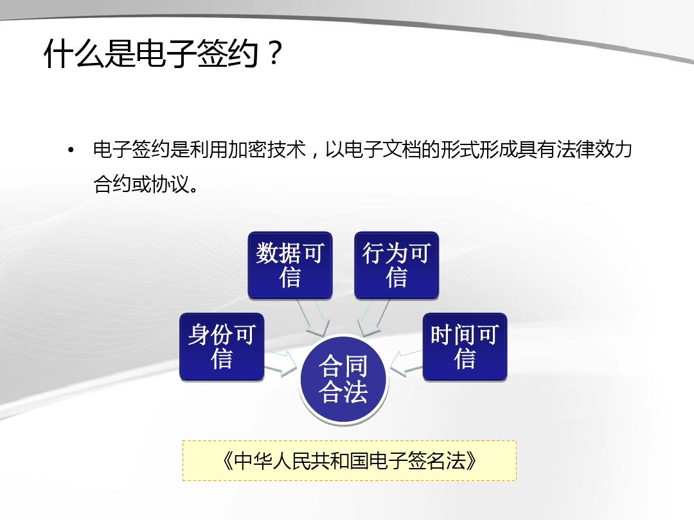

电子签约技术主要包括：数字证书安全认证、数字签名、时间戳等技术。

#####  根据《电子签名法》第五条至第八条规定，锁定签约主体真实身份、有效防止文件篡改、精确记录签约时间的电子合同才被法律认可

怎么进行电子签约才有法律效力呢?下面我们以第三方电子签约平台法大大为例，给大家详细介绍一下具体签约流程：

用户向法大大提交申请，法大大验证用户的真实身份后，为用户签发PDF文件签名证书，证书包含用户身份信息、用户证书私钥等数据。用户可在发起合同签署时对文档进行数字签名并发送，接收方收到合同后，自动验证数字签名，确认文件签署人身份可信，且文档在传输过程中没有被非法篡改，随即签名，电子签约即完成。在这个过程中，法大大电子签约平台通过严格的实名认证、可靠的电子签名、先进的第三方取时、区块链存证等技术手段，确保合同签署双方的真实身份、真实意愿，达到电子合同防抵赖、防篡改的目的。