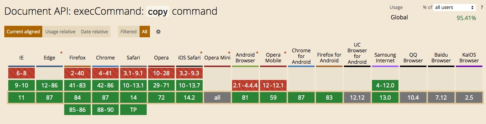
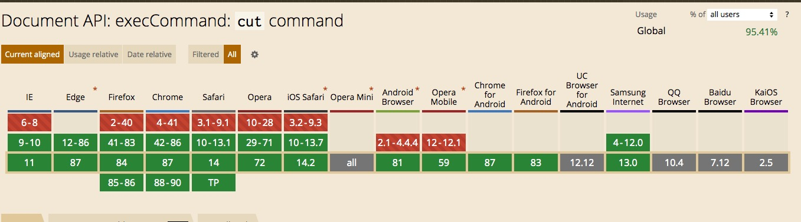
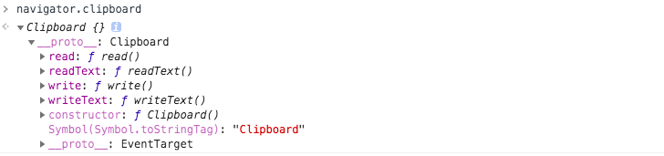
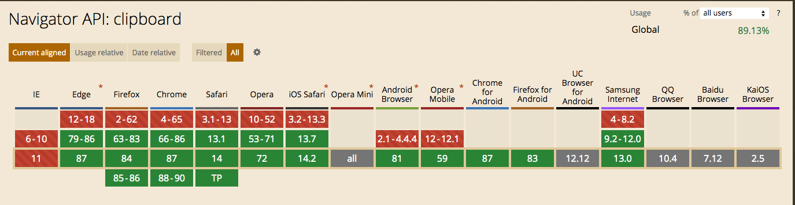

# clipboard.js


## why

> 将文本复制到剪贴板应该不难。它不需要几十个步骤来配置，也不需要加载数百 KB 的文件。最最重要的是，它不应该依赖于 Flash 或其他任何框架。


该库依赖于 Selection 和 execCommand API，几乎所有的浏览器都支持 Selection API，然而 execCommand API 却存在一定的兼容性问题：





当然对于较老的浏览器，clipboard.js 也可以优雅地降级。

# Install

```
npm install clipboard --save
```

或者直接使用cdn链接或下载本地使用

```
<script src="https://cdn.bootcdn.net/ajax/libs/clipboard.js/2.0.6/clipboard.js"></script>
```


## Usage

```html
<!-- Target -->
<input id="foo" value="我是被拷贝的文字">

<!-- Trigger -->
<button class="btn" data-clipboard-target="#foo">
    拷贝1
</button>
```

```javascript
var clipboard = new ClipboardJS('.btn');

  clipboard.on('success', function(e) {
    onsole.info('Action:', e.action);
    console.info('Text:', e.text);
    console.info('Trigger:', e.trigger);
		
    e.clearSelection();
  });
    
  clipboard.on('error', function(e) {
    console.error('Action:', e.action);
    console.error('Trigger:', e.trigger);
  });
```

使用**data-clipboard-target** 指定拷贝目标，最好是id选择器，其他选择器如类选择器，指定多个目标，默认拷贝的是第一个。

如果想执行的操作是剪切，则需要通过 **data-clipboard-action** 传入 *cut* 值

```
<!-- Target -->
<textarea id="bar">我是被剪切的值</textarea>

<!-- Trigger -->
<button class="btn" data-clipboard-action="cut" data-clipboard-target="#bar">
    Cut to clipboard
</button>
```


另外除了用**data-clipboard-target** 指定拷贝目标，也可以在实例化 clipboard 对象时，设置复制的目标：

```
let clipboard = new ClipboardJS('.btn', {
  target: function() {
    return document.querySelector('div');
  }
});
```

如果需要设置复制的文本，我们也可以在实例化 clipboard 对象时，设置复制的文本：

```
let clipboard = new ClipboardJS('.btn', {
  text: function() {
    return 'to be or not to be';
  }
});
```

如果在 Bootstrap 模态框（Modals）中使用，或是在其他修改焦点的类库中使用，你会希望将获得焦点的元素设置为 `container`属性的值。

```
new ClipboardJS('.btn', {
    container: document.getElementById('modal')
});
```

事件对象销毁：

```
var clipboard = new ClipboardJS('.btn');
clipboard.destroy();
```


**Clipboard** 接口实现了 Clipboard API，如果用户授予了相应的权限，就能提供系统剪贴板的读写访问。在 Web 应用程序中，Clipboard API 可用于实现剪切、复制和粘贴功能。该 API 用于取代通过 document.execCommand API 来实现剪贴板的操作。

在实际项目中，我们不需要手动创建 `Clipboard` 对象，而是通过 `navigator.clipboard` 来获取  `Clipboard` 对象：



在获取 `Clipboard` 对象之后，我们就可以利用该对象提供的 API 来访问剪贴板，比如：

```
navigator.clipboard.readText().then(
  clipText => document.querySelector(".editor").innerText = clipText);
```

以上代码将 HTML 中含有 `.editor` 类的第一个元素的内容替换为剪贴板的内容。如果剪贴板为空，或者不包含任何文本，则元素的内容将被清空。这是因为在剪贴板为空或者不包含文本时，`readText` 方法会返回一个空字符串。

在继续介绍 Clipboard API 之前，我们先来看一下 **Navigator API: clipboard** 的兼容性：



（图片来源：https://caniuse.com/mdn-api_navigator_clipboard）

异步剪贴板 API 是一个相对较新的 API，浏览器仍在逐渐实现它。由于潜在的安全问题和技术复杂性，大多数浏览器正在逐步集成这个 API。对于浏览器扩展来说，你可以请求 clipboardRead 和 clipboardWrite 权限以使用 clipboard.readText() 和 clipboard.writeText()。

### 将数据写入到剪贴板

#### writeText()

writeText 方法可以把指定的字符串写入到系统的剪贴板中，调用该方法后会返回一个 Promise 对象：

```
<button onclick="copyPageUrl()">拷贝当前页面地址</button>
<script>
   async function copyPageUrl() {
     try {
       await navigator.clipboard.writeText(location.href);
       console.log("页面地址已经被拷贝到剪贴板中");
     } catch (err) {
       console.error("页面地址拷贝失败: ", err);
     }
  }
</script>
```

对于上述代码，当用户点击 **拷贝当前页面地址** 按钮时，将会把当前的页面地址拷贝到剪贴板中。

#### write()

write 方法除了支持文本数据之外，还支持将图像数据写入到剪贴板，调用该方法后会返回一个 Promise 对象。

```
<button onclick="copyPageUrl()">拷贝当前页面地址</button>
<script>
   async function copyPageUrl() {
     const text = new Blob([location.href], {type: 'text/plain'});
     try {
       await navigator.clipboard.write(
         new ClipboardItem({
           "text/plain": text,
         }),
       );
       console.log("页面地址已经被拷贝到剪贴板中");
     } catch (err) {
       console.error("页面地址拷贝失败: ", err);
     }
  }
</script>
```

在以上代码中，我们先通过 Blob API 创建 Blob 对象，然后使用该 Blob 对象来构造 `ClipboardItem` 对象，最后再通过 `write` 方法把数据写入到剪贴板。介绍完如何将数据写入到剪贴板，下面我们来介绍如何从剪贴板中读取数据。

### 从剪贴板中读取数据

#### readText()

readText 方法用于读取剪贴板中的文本内容，调用该方法后会返回一个 Promise 对象：

```
<button onclick="getClipboardContents()">读取剪贴板中的文本</button>
<script>
   async function getClipboardContents() {
     try {
       const text = await navigator.clipboard.readText();
       console.log("已读取剪贴板中的内容：", text);
     } catch (err) {
       console.error("读取剪贴板内容失败: ", err);
     }
   }
</script>
```

对于上述代码，当用户点击 **读取剪贴板中的文本** 按钮时，如果当前剪贴板含有文本内容，则会读取剪贴板中的文本内容。

#### read()

read 方法除了支持读取文本数据之外，还支持读取剪贴板中的图像数据，调用该方法后会返回一个 Promise 对象：

```
<button onclick="getClipboardContents()">读取剪贴板中的内容</button>
<script>
async function getClipboardContents() {
  try {
    const clipboardItems = await navigator.clipboard.read();
    for (const clipboardItem of clipboardItems) {
      for (const type of clipboardItem.types) {
        const blob = await clipboardItem.getType(type);
        console.log("已读取剪贴板中的内容：", await blob.text());
      }
    }
  } catch (err) {
      console.error("读取剪贴板内容失败: ", err);
    }
  }
</script>
```

对于上述代码，当用户点击 **读取剪贴板中的内容** 按钮时，则会开始读取剪贴板中的内容。

## Selection 与 execCommand API

#### 3.1 Selection API

`Selection` 对象表示用户选择的文本范围或插入符号的当前位置。它代表页面中的文本选区，可能横跨多个元素。文本选区由用户拖拽鼠标经过文字而产生。如果要获取用于检查或修改的 `Selection` 对象，可以调用 `window.getSelection` 方法。

Selection 对象所对应的是用户所选择的 `ranges` （区域），俗称 **拖蓝**。默认情况下，该函数只针对一个区域，我们可以这样使用这个函数：

```
let selection = window.getSelection();
let range = selection.getRangeAt(0);
```

以上示例演示了如何获取选区中的第一个区域，其实除了获取选区中的区域之外，我们还可以通过 `createRange` API 创建一个新的区域，然后将该区域添加到选区中：

```
<div>大家好，我是<strong>阿宝哥</strong>。欢迎关注<strong>全栈修仙之路</strong></div>
<script>
   let strongs = document.getElementsByTagName("strong");
   let s = window.getSelection();

   if (s.rangeCount > 0) s.removeAllRanges(); // 从选区中移除所有区域
   for (let i = 0; i < strongs.length; i++) {
     let range = document.createRange(); // 创建range区域
     range.selectNode(strongs[i]); // 让range区域包含指定节点及其内容
     s.addRange(range); // 将创建的区域添加到选区中
   }
</script>
```

以上代码用于选中页面中所有的 `strong` 元素，但需要注意的是，目前只有使用 Gecko 渲染引擎的浏览器，比如 Firefox 浏览器实现了多个区域。


在某些场景下，你可能需要获取选中区域中的文本。针对这种场景，你可以通过调用 Selection 对象的 `toString` 方法来获取被选中区域中的纯文本。

#### 3.2 execCommand API

`document.execCommand` API 允许运行命令来操作网页中的内容，常用的命令有 bold、italic、copy、cut、delete、insertHTML、insertImage、insertText 和 undo 等。下面我们来看一下该 API 的语法：

```
bool = document.execCommand(aCommandName, aShowDefaultUI, aValueArgument)
```

相关的参数说明如下：

- aCommandName：字符串类型，用于表示命令的名称；
- aShowDefaultUI：布尔类型，用于表示是否展示用户界面，一般为 false；
- aValueArgument：额外参数，一些命令（比如 insertImage）需要额外的参数（提供插入图片的 URL），默认为 null。

调用 `document.execCommand` 方法后，该方法会返回一个布尔值。如果是 `false` 的话，表示操作不被支持或未被启用。对于 clipboard.js 这个库来说，它会通过 `document.execCommand` API 来执行 `copy` 和 `cut` 命令，从而实现把内容复制到剪贴板。

那么现在问题来了，我们有没有办法判断当前浏览器是否支持 `copy` 和 `cut` 命令呢？答案是有的，即使用浏览器提供的 API —— Document.queryCommandSupported，该方法允许我们确定当前的浏览器是否支持指定的编辑命令。

clipboard.js 这个库的作者，也考虑到了这种需求，所以提供了一个静态的 `isSupported` 方法，用于检测当前的浏览器是否支持指定的命令：

```
// src/clipboard.js
static isSupported(action = ['copy', 'cut']) {
  const actions = (typeof action === 'string') ? [action] : action;
  let support = !!document.queryCommandSupported;

  actions.forEach((action) => {
    support = support && !!document.queryCommandSupported(action);
  });

  return support;
}
```

Document.queryCommandSupported 兼容性较好，大家可以放心使用，具体的兼容性如下图所示：


（图片来源：https://caniuse.com/?search=queryCommandSupported）

介绍完 Selection、execCommand 和 queryCommandSupported API，接下来我们开始分析 clipboard.js 的源码。


资料来源：

[clipboardjs中文网](http://www.clipboardjs.cn/)

[这个 29.7 K 的剪贴板 JS 库有点东西！](https://mp.weixin.qq.com/s/v2pQ5Oqmc4AaBsquIacoBg)