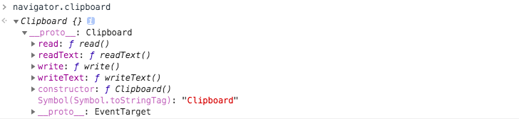

## Clipboard API

**Clipboard** 接口实现了 Clipboard API，如果用户授予了相应的权限，就能提供系统剪贴板的读写访问。在 Web 应用程序中，Clipboard API 可用于实现剪切、复制和粘贴功能。该 API 用于取代通过 document.execCommand API 来实现剪贴板的操作。

在实际项目中，我们不需要手动创建 `Clipboard` 对象，而是通过 `navigator.clipboard` 来获取  `Clipboard` 对象：



在获取 `Clipboard` 对象之后，我们就可以利用该对象提供的 API 来访问剪贴板，比如：

```
navigator.clipboard.readText().then(
  clipText => document.querySelector(".editor").innerText = clipText);
```

以上代码将 HTML 中含有 `.editor` 类的第一个元素的内容替换为剪贴板的内容。如果剪贴板为空，或者不包含任何文本，则元素的内容将被清空。这是因为在剪贴板为空或者不包含文本时，`readText` 方法会返回一个空字符串。

在继续介绍 Clipboard API 之前，我们先来看一下 **Navigator API: clipboard** 的兼容性：


（图片来源：https://caniuse.com/mdn-api_navigator_clipboard）

异步剪贴板 API 是一个相对较新的 API，浏览器仍在逐渐实现它。由于潜在的安全问题和技术复杂性，大多数浏览器正在逐步集成这个 API。对于浏览器扩展来说，你可以请求 clipboardRead 和 clipboardWrite 权限以使用 clipboard.readText() 和 clipboard.writeText()。

### 将数据写入到剪贴板

#### writeText()

writeText 方法可以把指定的字符串写入到系统的剪贴板中，调用该方法后会返回一个 Promise 对象：

```
<button onclick="copyPageUrl()">拷贝当前页面地址</button>
<script>
   async function copyPageUrl() {
     try {
       await navigator.clipboard.writeText(location.href);
       console.log("页面地址已经被拷贝到剪贴板中");
     } catch (err) {
       console.error("页面地址拷贝失败: ", err);
     }
  }
</script>
```

对于上述代码，当用户点击 **拷贝当前页面地址** 按钮时，将会把当前的页面地址拷贝到剪贴板中。

#### write()

write 方法除了支持文本数据之外，还支持将图像数据写入到剪贴板，调用该方法后会返回一个 Promise 对象。

```
<button onclick="copyPageUrl()">拷贝当前页面地址</button>
<script>
   async function copyPageUrl() {
     const text = new Blob([location.href], {type: 'text/plain'});
     try {
       await navigator.clipboard.write(
         new ClipboardItem({
           "text/plain": text,
         }),
       );
       console.log("页面地址已经被拷贝到剪贴板中");
     } catch (err) {
       console.error("页面地址拷贝失败: ", err);
     }
  }
</script>
```

在以上代码中，我们先通过 Blob API 创建 Blob 对象，然后使用该 Blob 对象来构造 `ClipboardItem` 对象，最后再通过 `write` 方法把数据写入到剪贴板。介绍完如何将数据写入到剪贴板，下面我们来介绍如何从剪贴板中读取数据。

### 从剪贴板中读取数据

#### readText()

readText 方法用于读取剪贴板中的文本内容，调用该方法后会返回一个 Promise 对象：

```
<button onclick="getClipboardContents()">读取剪贴板中的文本</button>
<script>
   async function getClipboardContents() {
     try {
       const text = await navigator.clipboard.readText();
       console.log("已读取剪贴板中的内容：", text);
     } catch (err) {
       console.error("读取剪贴板内容失败: ", err);
     }
   }
</script>
```

对于上述代码，当用户点击 **读取剪贴板中的文本** 按钮时，如果当前剪贴板含有文本内容，则会读取剪贴板中的文本内容。

#### read()

read 方法除了支持读取文本数据之外，还支持读取剪贴板中的图像数据，调用该方法后会返回一个 Promise 对象：

```
<button onclick="getClipboardContents()">读取剪贴板中的内容</button>
<script>
async function getClipboardContents() {
  try {
    const clipboardItems = await navigator.clipboard.read();
    for (const clipboardItem of clipboardItems) {
      for (const type of clipboardItem.types) {
        const blob = await clipboardItem.getType(type);
        console.log("已读取剪贴板中的内容：", await blob.text());
      }
    }
  } catch (err) {
      console.error("读取剪贴板内容失败: ", err);
    }
  }
</script>
```

对于上述代码，当用户点击 **读取剪贴板中的内容** 按钮时，则会开始读取剪贴板中的内容。


### 实现复制图像的功能

在最后的这个示例中，阿宝哥将跟大家一步步实现复制图像的核心功能，除了复制图像之外，还会同时支持复制文本。在看具体代码前，我们先来看一下实际的效果：


在上图对应的网页中，我们先点击 **复制** 按钮，则图像和文本都会被选中。之后，我们在点击 **粘贴** 按钮，则控制台会输出从剪贴板中读取的实际内容。在分析具体的实现方式前，我们先来看一下对应的页面结构：

```
<div id="container">
   
   <p>hello ,hello </p>
</div>
<button onclick="writeDataToClipboard()">复制</button>
<button onclick="readDataFromClipboard()">粘贴</button>
```

上面的页面结构很简单，下一步我们来逐步分析一下以上功能的实现过程。

#### 5.1 请求剪贴板写权限

默认情况下，会为当前的激活的页面自动授予剪贴板的写入权限。出于安全方面考虑，这里我们还是主动向用户请求剪贴板的写入权限：

```
async function askWritePermission() {
  try {
    const { state } = await navigator.permissions.query({
      name: "clipboard-write",
    });
      return state === "granted";
  } catch (error) {
      return false;
  }
}
```

#### 5.2 往剪贴板写入图像和普通文本数据

要往剪贴板写入图像数据，我们就需要使用 `navigator.clipboard` 对象提供的 write 方法。如果要写入图像数据，我们就需要获取该图像对应的 Blob 对象，这里我们可以通过 `fetch` API 从网络上获取图像对应的响应对象并把它转化成 Blob 对象，具体实现方式如下：

```
async function createImageBlob(url) {
  const response = await fetch(url);
  return await response.blob();
}
```

而对于普通文本来说，只需要使用前面介绍的 Blob API 就可以把普通文本转换为 Blob 对象：

```
function createTextBlob(text) {
  return new Blob([text], { type: "text/plain" });
}
```

在创建完图像和普通文本对应的 Blob 对象之后，我们就可以利用它们来创建 `ClipboardItem` 对象，然后再调用 write 方法把这些数据写入到剪贴板中，对应的代码如下所示：

```
async function writeDataToClipboard() {
  if (askWritePermission()) {
    if (navigator.clipboard && navigator.clipboard.write) {
        const textBlob = createTextBlob("大家好，我是阿宝哥");
        const imageBlob = await createImageBlob(
          "http://cdn.semlinker.com/abao.png"
        );
        try {
          const item = new ClipboardItem({
            [textBlob.type]: textBlob,
            [imageBlob.type]: imageBlob,
          });
          select(document.querySelector("#container"));
          await navigator.clipboard.write([item]);
          console.log("文本和图像复制成功");
        } catch (error) {
          console.error("文本和图像复制失败", error);
        }
      }
   }
}
```

在以上代码中，使用了一个 `select` 方法，该方法用于实现选择的效果，对应的代码如下所示：

```
function select(element) {
  const selection = window.getSelection();
  const range = document.createRange();
  range.selectNodeContents(element);
  selection.removeAllRanges();
  selection.addRange(range);
}
```

通过 `writeDataToClipboard` 方法，我们已经把图像和普通文本数据写入剪贴板了。下面我们来使用 `navigator.clipboard` 对象提供的 `read` 方法，来读取已写入的数据。如果你需要读取剪贴板的数据，则需要向用户请求 `clipboard-read` 权限。